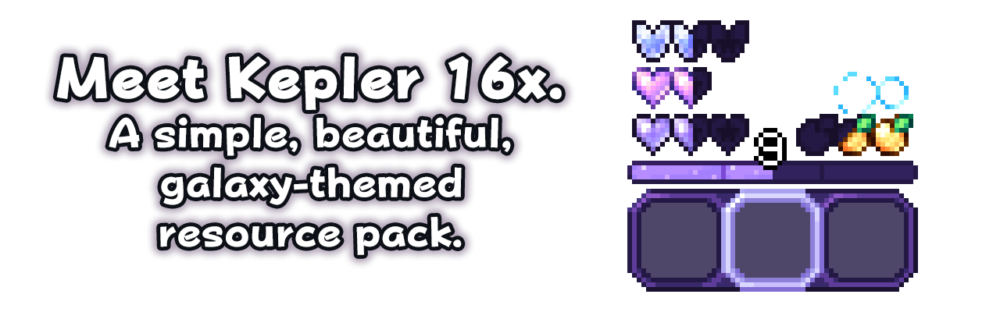

# Kepler 16x v1.2.0 WIP ([Changelog](https://github.com/renapti/Kepler-16x/blob/main/Changelog.md))

*Kepler is still very much not done! Expect more to be added, removed, or changed in the future!*

## Features

- **Smooth, Round, and Original Font** (named "Bubbles")
  - Want something more playful? Check out the alternate version of Bubbles!²
- **Custom Language** (named "Renaptish")¹
- **Shiny New HUD!**
  - Hearts, Armor, Food, and Bubbles (not the font!)
  - XP Bar
  - Hotbar
  - Bossbars
  - Smaller Crosshair
- **Clean GUI!** Shiny Purple Menu Buttons with a Consistent Color Scheme
- **Custom Block Breaking Animation**
- **Custom Particles**
  - Critical
  - Magic Damage
  - Explosion
  - Damage Indicator
  - Potion Swirlies
- **Cleaner Enchantment Glint**
- **Improved Overlays**
  - Carved Pumpkin Overlay
  - Removed Underwater Overlay
- **Short Swords and Tweaked Tools**¹
- **Sleek, Minimal Container Menus**
- **Shorter Enchantment Names**
- **Attribute Icons**¹
- **Custom Colors for [OptiFine](https://optifine.net/downloads) / [Colormatic](https://modrinth.com/mod/colormatic/versions) users**
  - Font Color Scheme
  - Durability Bar
  - XP Orb Color
- **Custom Colors for Everyone Else!**
  - Custom Item Tooltip
  - Resource Loading Screen¹
  - XP Level Text
  - White Block Outline
  - Sodium Menu Accent Color¹

¹*Feature will not be included in 1.8 port*

---

## Compatible Versions

- [x] Java 1.19
- [x] Java 1.8 (Most features should work OOTB — expect an official port soon)
- [ ] Bedrock (Not yet planned)

---

## Recommendations

This Resource Pack is compatible with [Appleskin](https://modrinth.com/mod/appleskin/versions)! Get a handy overlay of your saturation, now with Kepler Compatibility!

I recommend using [OptiFine](https://optifine.net/downloads) / [Colormatic](https://modrinth.com/mod/colormatic/versions) with this pack for the Custom Font Colors, Durability Bar Gradient, and XP Orb Color, however it is by no means required.

There is a [long-unfixed bug](https://bugs.mojang.com/browse/MC-67532) in Minecraft that cuts off the bottom of the Hotbar selector. Luckily, this issue has been fixed with the mod [Raised](https://modrinth.com/mod/raised/versions), which I highly recommend using with this pack.

---

## Screenshots

*Screenshots taken with a development version of Kepler v1.1.0. These may vary from the downloaded final product. Textures, Colors, Wording, and more may be subject to change.*

## Main Menu

 Show Screenshots 

## Font (Bubbles)²

 Show Screenshots 

Bubbles (Default)

Bubbles (Alt, instructions below*)

### Old Colors

## Items

 Show Screenshots 

### *Most Tools are Vanilla, with slight tweaks to the Sticks, Swords, and more*

## GUI

 Show Screenshots 

### Common Inventories

### HUD: Hotbar and Crosshair

### Item Tooltips, Stats, and Abbreviated Enchantments

### [Appleskin](https://modrinth.com/mod/appleskin/versions) Textures

---

## ²Installing Bubbles Alt

This resource pack comes with two versions of its custom font, Bubbles. The default version is the definitive version of the font, and the alternate version looks closer to crude handwriting.

The folder for Bubbles Alt is included in every release (if it has been updated in that release). To install it, grab a copy of Kepler 16x and Bubbles Alt (if there is none in the latest release, you can download it from the latest branch, or look for the last release with Bubbles Alt), open the Bubbles Alt folder, and drag everything inside into your Kepler folder. You may be prompted to replace a few files, click `Yes`.

If the files copy successfully, Congratulations — You've now installed Bubbles Alt, just like that! You can drag Kepler 16x into your Minecraft instance's `resourcepacks` folder to use the pack with the alternate font.

*Bubbles Alt inspired by a Discord User "Jell-O"'s Custom Minecraft Font*

---

## Crediting renapti

### *You can distribute and modify this Resource Pack, and use it in your videos and other kinds of media! Credit not required, but heavily appreciated!*

## Shaders Credits

[position_color](Kepler-16x_1.19/assets/minecraft/shaders/core/position_color.fsh) and [rendertype_text](Kepler-16x_1.19/assets/minecraft/shaders/core/rendertype_text.fsh) are not mine!

They were made by [Enchanted_Games](https://www.planetminecraft.com/member/enchanted_games/) on Planet Minecraft.  
[Here's the link](https://www.planetminecraft.com/blog/changing-hardcoded-colours-1-18-1-17-core-shaders/) to the Template Pack I used!

## Programs Used

This Project was made possible by [Visual Studio Code](https://code.visualstudio.com/) and [Aseprite](https://www.aseprite.org/)!

---

## Giving Feedback

Kepler 16x is not perfect, and never will be. However, it can always be improved, and things can always be added or fixed! The latest, in-development versions of Kepler are always available to download in this repository, separate from releases.

If somethings awry, or you spot a mistake, feel free to open an issue or send me a DM on my socials so it can be fixed! Thank you!

### Contributing

At this time, the only way to directly contribute to Kepler 16x is to open issues or otherwise suggest improvements or changes to the pack, as mentioned above. Pull requests will not be approved.
